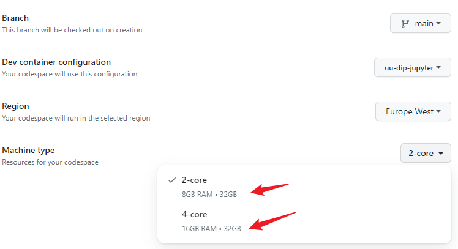

# Üsküdar Ünv. FBE Sayısal Görüntü İşleme

Dersteki alıştırmaları [gerekli](./.devcontainer/Dockerfile) [bileşenlerin](./.devcontainer/devcontainer.json) yüklü olduğu bir [devcontainer](https://containers.dev/) içinde [VS Code](https://code.visualstudio.com/) [Notebook](https://jupyter.org/) formatında takip edebilmek üzere hazırlandı. Alıştırmalar [./notebooks](./notebooks/) klasörü içinde haftalara göre tasnif edilmiş defterlerde.

## Çalıştırma Seçenekleri

### [Codespaces](https://docs.github.com/en/codespaces) Üzerinde

Herhangi bir bilgisayarda (yüksek donanıma gerek yok, modern bir tarayıcı çalıştırabilmesi yeterli) tarayıcı üzerinde çalışmak için ideal.

- Github hesabınızla oturum açın (an itibariyle ücretsiz hesap için aylık 120 saat/core veriyor: 2 core 60 saat, 4 core 30 saat boyunca kullanılabilir; eğitim hesabı için daha iyi koşullar [mevcut](https://github.com/features/codespaces#pricing)).
- Aşağıdaki gibi `Code>Codespaces` seçeneklerinden `New with options...` komutu ile devam edip
 
 uygun yapılandırmayı (en önemlisi makine tipi) seçip
 
 yeni bir ortam oluşturun:
 
- Bekleyin! İlk seferi _biraz_ uzun sürecek.
 
- Bir `notebook` açtıktan sonra eğer seçili değilse `venv` isimli `kernel`'i seçin.
 
- VS Code sadece bir editör, `Jupyter Notebook` özelliklerini kendi içinde sunuyor dolayısıyla aynı mantık geçerli.
- İşi bittiğinde [Codespaces](https://github.com/codespaces) adresinden (hakkın boşa gitmemesi için) ilgili makineyi kapatın (ya da tekrar kullanılmayacaksa silin).
 
- Tekrar kullanmak gerektiğinde [aynı adresten](https://github.com/codespaces) VS Code ya da Jupyter (ile tarayıcıdan ya da diğer seçeneklerle UZAKTAKİ ortama yerel bilgisayardan) bağlanabilirsin:
 

### Bilgisayardan

[Docker Desktop](https://docs.docker.com/get-docker/), [VS Code](https://code.visualstudio.com/) ve [Remote Extension](https://marketplace.visualstudio.com/items?itemName=ms-vscode-remote.vscode-remote-extensionpack) kurulu bir bilgisayarda bu repo'yu `clone`'layıp ilgili klasör için `Open Folder In Container...` komutunu çalıştırın.

Bu seçenek yerel kaynakları kullanabiliyor olması nedeniyle cihazın durumuna göre daha performanslı olabilir fakat bahsi geçen araçları kullanmayı gerektirdiği için tecrübe (sahibi olmayı ya da edinmek üzere zaman harcamayı) gerektiriyor.

## `opencv` (cv2) imshow

`cv2.imshow`, tarayıcıdan (ya da `container`'dan) erişmesi zor olan `window` ile çalıştığı için kullanmak mümkün olsa da pek tutarlı davranmıyor. Dolayısıyla basit bir `cv2_imshow` fonksiyonu ile benzer bir işlevselliği elde ediyoruz: burada orijinal içerikteki `cv2.imshow` yerine `cv2_imshow` kullanılıyor (ve `window` yapısını destekleyen diğer komutlar kullanılmıyor). Esas fonksiyonun tüm yetenekleri yok, basitçe `matplotlib.pyplot.imshow` fonksiyonunu (varsa renk dönüşümü yaparak) çağırıyor.

## İçeriği Değiştirmek İstersen

Codespaces ile ya da yerel olarak çalışırken yapılan değişiklikler bu repo'ya gelmeyecek. Kaybetmek istemediğiniz bir şeyler mutlaka olacaktır; bunun için önce bir `fork` alıp oradan devam etmek mantıklı olabilir.

## Yararlanılan Kaynaklar

Bahsi geçen teknoloji / araçların belgeleri dışında [jupyter-devbox](https://github.com/jakoch/jupyter-devbox) repo'sundaki `Dockerfile` bu ortamda `opencv` çalıştırabilmek için ciddi anlamda faydalı oldu.

## Koşullar

Buradaki bilgilerin doğruluğu ya da yeterliliği konusunda bir iddiam olmadığı gibi bunu tamamlamak ya da buradaki içerik hakkında destek vermek üzere de bir taahhütte bulunmuyorum. [Lisans dosyasında](LICENSE) detayı mevcut: bu içerik olduğu gibi ve bir sorumluluk/garanti olmadan sunuluyor.
